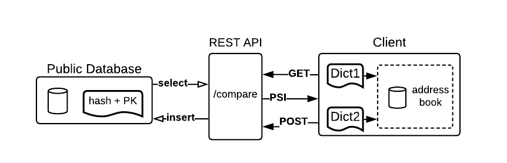

# Private Contact Discovery: An exemplary implementation

## Abstract
Contact Discovery is about finding out which of a users contacts are registered in an online service, e.g., a mobile messaging platform.
Private Contact Discovery treats all information confidentially and only discloses own contacts to the requesting user.
In current mobile messaging platforms a users individual privacy tends to be an afterthought, due to the convenience and ease of implementation of standard privacy invading matching services.

Additionally, even todays most sophisticated privacy preserving implementations rely on trust in both the hardware manufacturers and the service provider, which is non ideal, as privacy and convenience do not have to be mutually exclusive. 

To solve this problem we propose a trustless solution.
In our experiment, we perform a secure multiparty computation in the form of a private set intersection between a users contacts and a set of all registered contacts of a service to obfuscated both the request and the retrieved information.
Additionally, we introduce a new an unique method to effectively prevent a dictionary attack on the processed data set.

Our method makes dictionary attacks significantly more expensive and, therefore, raises the required computing resources to break user privacy to a reasonably high level to effectively prevent dictionary attacks.

## Introduction

Contract Discovery is needed when a new user joins a online social network or messaging service to provide the user with a list of fiends and colleagues to communicate with.
Adoption of a new social network or messaging service is hindered if users are instead met with an empty list of communication options.

State of the art social networks and messaging services, hence, store a social graph of its users to suggest communication options.
Such a social graph is even made accessible to other applications with the "log in with Google, Facebook, WeChat,..."-option.
Having a service provider storing a social graph, however, is not privacy preserving. 

The main problem of building a social graph using all users identifiers, is the risk of exploiting this information for greater harm.
For example, the connection between a user identity and phone number can be used to high jack a sim card through social engineering a telephone company's support hotline. 
Lee et .al [@LeeKMN20] showed that most of the US telecommunication companies are vulnerable to SIM swapping attack, and 17 websites on which user accounts can be compromised based on a SIM swap alone. 
Additionally, 140 analyzed websites offered phone-based authentication only.
Keeping such identifiers, like a phone number private, is of great interest to many security aware users.

In our approach, we hence, do not build a social graph, but rather make use of a minimal social graph each user already has on its phone, the address book.
We propose a solution where the contact data remains distributed and owned by the user. 
Only a obfuscated subset of the address books is used for the contact discovery service, without revealing the contacts in the address book to the messaging service.

This project is based on two assumptions:

1) Social services are ubiquitous and are not going anywhere anytime soon.
2) Privacy is important and shall not be about trust but a technical requirement.

Our goal is to find a way to increase the pre-image complexity to a point, where it is computationally infeasible to find an input that hashes to the processed values in our unbalanced private set intersection for private contact discovery.

## Related Work 

Many privacy aware social networks and messaging services implement methods for contact discovery which do not reveal information to third parties or evan service providers [@KalesRSS19].
One of the most popular implementations today, comes from the Signal messenger [^1].

Signal makes each client device hash its phone number locally before uploading [@marlinspike_technology_2017] the hash to their servers. 
This is in strong contrast to other messengers which offer less privacy respecting solutions. 
However, even though this is better than uploading and storing everything in plain text, a typical 
phone number only consists of about 10 digits. Hence these hashes are vulnerable to dictionary attacks [@bosnjak_brute-force_2018].
Signal is aware of this issue and therefore has to rely on a hardware solution called Software Guard Extension (SGX) from Intel.
This, however, only moves the trust issue to another party as the hardware architecture is now a single point of attack.
Signal's approach provides privacy as long as the integrity of the SGX-enclave is maintained and no side-channel attacks like "Platypus"[@Cimpanu20] are executed.
"Platypus" exploits Intel's power management to execute a side channel attack on the SGX enclave.

[^1]: https://signal.org/blog/private-contact-discovery/

The key to the solution of retrieving information of a set of private information without leaking any information can be a secure multiparty computation [@EVANS18].
The approach fo a private set intersection [@yanai_private_2020] as a variant of secure multiparty computation was proven useful by Signal, but remained vulnerable for dictionary attacks, as the overall amount of hashed phone numbers is relatively cheap to unmask through a brute-force/dictionary attack.

Unlike most current solutions we propose a new approach with greater resiliency against dictionary attacks. 
The methodology introduced in this project is based on our prior research [@ihle_first_2020] with revisions to accommodate the needs of a messaging service. 
We test a unbalanced private set intersection that with salted hashes to prevent the unmasking of hashes.

## Method 
For our approach, three criteria have to be met:

* no exchange of plaintext information 
* resiliency against dictionary attacks
* not relying on single proprietary hardware solutions

To increase the pre-image complexity not only a singular phone number is hashed 
and uploaded but combinations [@ihle_first_2020] of phone numbers. 
For every contact available in a given address book a combination of both the 
owner's and a contact's phone number is hashed.

This way the server only ever sees the hashes and does not gather any 
information about registered clients. Even though the pre-image complexity is increases to the power of 2, all benefits vanish assuming an attacker knows the (1) relation between a target and another individual and
(2) that individual's phone number.

To address this issue we add a salt to the initial hash generation approach. 
The salt can be any common shared secret, i.e., privately disclosed information only known to both contacts that want to interact with each other. 
We have to assume that no service specific shared secret has been generated beforehand and, therefore, have to rely on information which already exists in the users' devices. 
For the purpose of this experiment we use the date of last interaction/communication through a mobile communication channel (e.g. last call or SMS).

Note that for the hash generation the order of contacts is important due to the deterministic nature of hashing algorithms.

Because of the unique hashes generated by each arrangement, there is a clear differentiation between hashes Alice generated to check for Bob and hashes Bob generated to check for Alice. 
Because of this uniqueness Alice will not receive any false positives about Bob's registration until Bob registered himself having Alice in his address book.

For the selection of the underlying state-of-the-art hash algorithm the preconditions are reasonable collision resistance and a feasible balance between complexity, speed and the disk space required. Assuming 2 billion users having 
an average of 200 contacts in their address book. 
Table (1) shows standard hashing algorithms and their time to hash 1 mio 20-digit numbers, with their hash size and required disk space.
For our experiment we picked SHA1 as a reasonable hashing algorithm.

|Hashing algorithm|Time to hash 1.000.000 20-digit numbers|Digest sizes|Disk space required for 4e+11 hashes|
|-|-|-|-|
|SHA1|650ms|$2^{160}$|60 TB|
|SHA256|830ms|$2^{256}$|88 TB|
|SHA512|1.1s|$2^{512}$|136 TB|
|MD5|650ms|$2^{128}$|60 TB|

Due to the deterministic nature of hashing algorithms, it is pointless to brute force hash collisions as an attacker would not gain any information about the phone number(s) he/she is looking for. 
Assuming a collision (as in a false positive hash) happened during a client's request for an intersection, the key exchange between both contacts shall fail.

### Key exchange
Once a client knows about already registered contacts a Diffie-Hellman key exchange [@nan_li_research_2010] takes place. 
The public keys can be extracted from our central database. 
However we can not just post each parties public key linked to their phone number. 
That would defeat the whole purpose of this project. 

We, hence, apply a way to get a hold of each others public key without exposing the corresponding phone number, whether not in p be in plaintext nor hashed. 

As mentioned earlier we can suppress false positives by hashing our combinations in two different orders, starting with Bob, or starting with Alice. 
This way it is possible to append the public key to those hashes known by both parties.
This public key can then be extracted by splitting the substring of the containing string.

We end up having two hashes for each perspective:

* hashed_combination
  * this one is known by both parties and can be identified
* hashed_combination + public key
  * this one is unknown, but we know the hashed_combination.

To access the secret we can scan the database for values that are known to us 
and figure out if there are any hashes that start with that specific 
hexadecimal number. The ending bits represent the public secret.

## Experiment

The architecture resembles a typical CRUD service. PostgreSQL is used as our database backend. 
A REST API serves an interface to GET an intersection of already registered friends and POST a user registration to an exemplary service.

Figure 1 shows all used system entities and their interfaces.

The address book holds only fictional addresses and stores all phone numbers in a separate database. 
The rest api processes the user requests and inserts or retrieves information from the public postgreSQL database, which hold all salted and hashed phone number combinations together with a the public keys.

The client constructs two dictionaries of number combinations, before interacting with the API.
Theses two dictionaries differ in the order of numbers, but both contain a common secret, unique to each contact.
The first dictionary is used to publish all contacts to the contact discovery service.
The second dictionary is not published, but used to verify any retrieved hash from the service to filter false positives.

Additionally to the dictionary, a users public key is appended to the hash combinations before publishing, so that the desired public key can be retrieved and used for a encrypted communication initiation.

To test the contact discovery, we than published multiple fictional address books and checked for intersections, leading to successfully retrievals of the desired public keys.

# Evaluation
In this section we discuss our architecture and experiment in regard to the three criteria we aimed for:

* no exchange of plaintext information 
* resiliency against dictionary attacks
* not relying on proprietary hardware solutions

## No exchange of plaintext information 

Assuming there is a privately disclosed secret known by both parties, this 
approach provides a methodology to discover your contacts privately.

## Resiliency against dictionary attacks
Through the unique combination of the user's phone number, his/her contacts, and a shared secret we achieve reasonable resiliency against dictionary attacks, but given an infinite amount of computing resources any hash can be matched to its input value or a hash collision. 
The workload to compute hashes scales horizontally. 
Thus, the critical data needed to evaluate the feasibility of computing a specific dictionary in 
question is the price to pay for the computing resources necessary:

On a modern computer (6core, 2.8GHz), it takes 0.00063 milliseconds 
(6.3e-7 seconds) to compute a SHA1 hash. This translates to 1.5e+6 hashes 
per second. Assuming the desired pre-image is computed after half of the 
possible combinations (pre-image complexity of 1e+20 without salt), it would 
take approximately 1 million years of computing to get the desired hash. 
A comparable VM rental on Azure is about 2 billion USD.

|Complexity of pre-image|Estimated time required to compute a desired hash on modern hardware (single machine)|Estimated cost of computation
|-|-|-|
|1e+10|1 hour|essentially free|
|1e+15|10 years|10.000 USD|
|1e+20|1e+6 years|1 billion USD|
|1e+25|1e+11 years|1e+14 USD|

Using this methodology, the upfront cost of resources necessary to compute a specific dictionary in question is significantly higher. 
Assuming that a dictionary attack would be successful, a unmasked hash would lead to the exploitation of the corresponding dictionary, hence, not only a registered phone number, but its entire address book would be exposed simultaneously.

Although the approach is not impenetrable, the desired resilience can be easily adjusted, using other hash algorithms or a shared secret with higher complexity to achieve the desired resilience level.

## Not relying on proprietary hardware solutions
Some platforms (e.g. Signal) fall back on hardware solutions. 
This means all data has to go through a centralized API and the service is bound to very specific hardware provided by a single proprietary manufacturer.
In our privacy preserving contact discovery architecture, sensitive data does never leave a user's device in plaintext.
With full ownership and access, user privacy is entirely in the user's hands.
It is, therefore, the responsibility of the user to maintain the integrity of the device and not leak sensitive data over other applications, services, or communication channels.

## Conclusion
Currently no publicly available platform implements a trustless contact discovery service.
In our experiment, we could show that a trustless private contact discovery design is possible and no exchange of plaintext data is needed to make use of the contact discovery service.
We introduced a new and unique method to effectively prevent dictionary attacks and, hence, successfully improved unbalanced private set intersections for the specific use case of contact discovery.
We consider this project as a work in progress, and plan to extend our implementation with scalability and decentralization in mind.

## Future Work
For our future research with have a number of possible improvements in mind.

Our first implementation still stores all hashes in a centralized database. 
To prevent a singe point of attack, the storage shall be decentralized using a public distributed storage solution.
A fully decentralized implementation introduces many unknown parameters which we will analyze to evaluate the scalability and performance of the approach. 
Additionally, this project's scope did not include any implementation on current smartphone operating systems. To push this approach into production a privately disclosed common secret between two contacts has to be evaluated in more detail.
Ideally, a user should have the option to create a new public key for the discovery of every contact in his address book to prevent malicious contacts from corelating published hashes of other users. 

## References
