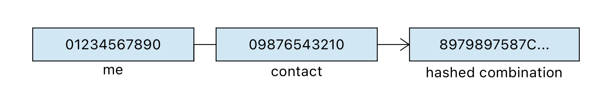
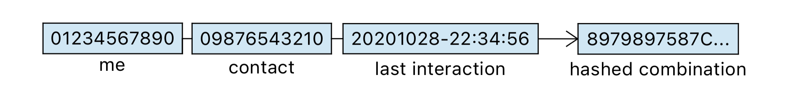

# Private Contact Discovery: An exemplary implementation

## Abstract
This project is about a matching service available to users providing a way to 
get to know which of an individual's contacts is registered on an online 
service such as a messaging platform without invading an individual's privacy. 
Due to the increased convenience and ease of implementation provided by privacy 
invading matching services, privacy tends to be an afterthought. However, 
privacy and convenience do not have to be mutually exclusive. 
The main issue to solve is about enabling private set intersection. 
Current solutions are centralised and do not provide a way of private set 
intersections. The methodology introduced in this project is based on research 
done by C. Ihle et al.¹ and transferred to accommodate the needs of a 
messaging service. This methodology results in a significant increase of 
computing resources necessary to gather user information in case of a data 
breach.

# (1) Overview

## Introduction
This project is based on two assumptions:

1) Social services are ubiquitous and are not going anywhere anytime soon
2) Privacy is important and shall not be about austerity and trust but a 
technical requirement

"(...) when someone shares a photo with their friends, their intent is to share 
it with their friends. Not the service operator, ad networks, hackers, or 
governments." ²

Equally when you want to know whether a contact of yours is registered online 
you do not intent to share neither his/her nor your own privately disclosed 
information to anyone but you and your desired contact. Yet social services 
need some kind of matching service to get a client the information he/she 
desires. Implementing a contact discovery service itself is rather 
straightforward. Doing that while respecting privacy less so.

### What is private contact discovery and why is it important?
In essence private contact discovery describes a matching service allowing 
clients to find out whether or not a contact is registered on a given service 
without ever getting any information about any registered client.

The most prevalent privacy respecting solution for a contact discovery service 
as of right now is implemented by Signal for their messenger.

### Signal messenger
Signal took a first step in the right direction. Signal makes each client 
device hash its phone number locally on the edge **before uploading** that 
hash to their servers. This is in stark contrast to other messengers which are 
not looking deep into privacy respecting solutions. This is due to monetary 
reasons among others. However, even though this is better than uploading and 
storing everything in plain text, a typical phone number only consists of about 
10 digits. Hence these hashes are vulnerable to brute-force/dictionary attacks.

Signal is aware of this issue and therefore falls back on a hardware solution. 
In this case Intel's trusted execution environment (SGX) is being used. This 
however only moves the trust issue to another level/party and does not solve it 
for good.

## Improvement approach
Research question: Can we find a way to increase our pre-image complexity up to 
a point of making it computationally infeasible to find an input that hashes to 
a specific value?

In other words - two criteria have to be matched:

* do **not** rely on **proprietary** hardware solutions
* provide a possibility of private set intersection

## Implementation and architecture
To increase the pre-image complexity not only a singular phone number is hashed 
and uploaded but combinations of phone numbers. For every contact available in 
a given address book a combination of both the owner's and a contact's phone 
number is hashed.

This way the server only ever sees the hashes and does not gather any 
information about registered clients. Even though the pre-image complexity is 
exponentially doubled, all benefits vanish assuming an attacker knows

* of a relation between a target and another individual and
* that individual's phone number.

To address this issue a salt is introduced. The salt consists of privately 
disclosed information only known to both contacts that want to interact with 
each other, such as a date of last interaction.

Note that the order of contacts is important due to the deterministic nature of 
hashing algorithms.

Because of the unique hashes generated by each arrangement, there is a clear 
differentiation between hashes Alice generated for Bob and hashes Bob generated 
for Alice. Because of this uniqueness Alice will not receive any false 
positives about Bob's registration until Bob registered himself having Alice in 
his address book.

The hashing algorithm of choice shall provide a nice balance between 
complexity, speed and the disk space required. Assuming 2 billion users having 
an average of 200 contacts in their address book, SHA1 is a reasonable pick.

|Hashing algorithm|Speed|Complexity|Disk space required|
|-|-|-|-|
|SHA1||||
|SHA256||||
|SHA512||||
|MD5||||

Due to the deterministic nature of hashing algorithms, it is pointless to brute 
force hash collisions as an attacker would not gain any information about the 
phone number(s) he/she is looking for. Assuming a collision (as in a false 
positive hash) happened during a client's request for an intersection, the key 
exchange between both contacts shall fail.

The architecture resembles a typical CRUD service. PostgreSQL is used as our 
database backend. A REST API shall serve an interface to

* GET an intersection of already registered friends
* POST your registration

### Key exchange
Once a client knows about already registered contacts a Diffie-Hellman key 
exchange takes place. The public keys can be extracted from our PostgreSQL 
database. However WE CAN NOT just post each parties public secret linked to 
their phone number. That would defeat the whole purpose of this project. Yet 
there is a way to get a hold of each others public secret without exposing the 
corresponding phone number (whether that would be in plain text or hashed).

As mentioned earlier we can suppress false positives by hashing our 
combinations in two ways. This way it is possible to append the public secret 
to those hashes known by both parties.

We end up having two hashes for each perspective:

* hashed_combination
  * this one is known by both parties and can be identified
* hashed_combination + public secret
  * this one is foreign, but we know the hashed_combination.

To access the secret we can scan the database for values that are known to us 
and figure out if there are any hashes that start with that specific 
hexadecimal number. The ending bits represent the public secret.

# Evaluation
Currently no publicly available platform implements its contact discovery 
service providing a possibility for private set intersection. To counteract 
this issue some platforms (e.g. Signal) fall back on hardware solutions. This 
means all data has to go through a centralised API and the service is bound to 
very specific hardware provided by a single proprietary manufacturer.

## Is a contact discovery service implemented using this methodology more private than the status quo?
This approach for improving privacy when discovering contacts accomplishes both 
criteria that were set earlier: 

* do NOT rely on hardware solutions
* provide a possibility of private set intersection

Assuming there is a privately disclosed secret known by both parties, this 
approach provides a methodology to discover your contacts privately.

This approach is not impenetrable though. Given infinite amount of computing 
resources any hash can be matched to its input value or collision thereof. 
The workload to compute hashes is horizontally scalable. Thus, the critical 
data needed to evaluate the feasibility of computing a specific dictionary in 
question is the price to pay for the computing resources necessary:

On a modern computer (6core, 2.8GHz), it takes 0.00063 milliseconds 
(6.3e-7 seconds) to compute a SHA1 hash. This translates to 1.5e+6 hashes 
per second. Assuming the desired pre-image is computed after half of the 
possible combinations (pre-image complexity of 1e+20 without salt), it would 
take approximately 1 million years of computing to get the desired hash. 
A comparable VM rental on Azure is about 2 billion USD.

|Complexity of pre-image|Estimated time required to compute a desired hash on modern hardware (single machine)|Estimated cost of computation
|-|-|-|
|1e+10|||
|1e+15|||
|1e+20|1e+6 years|2 billion USD|
|1e+25|||
|1e+30|||

Using this methodology, the upfront cost of resources necessary to compute a 
specific dictionary in question is significantly higher. Assuming that, under 
any circumstances (such as a botnet), a corresponding dictionary is computed 
however, not only a registered phone number, but its entire address book is 
being exposed simultaneously.

## Closing thoughts
Whether or not the upfront cost of computation this approach introduces causes 
the computation of a desired hash to be infeasible is up for discussion.

This approach still stores all hashes in a centralised database. 
Optimally the storage shall be decentralised.

Additionally, this project's scope did not include any implementation on 
current smartphone operating systems. To push this approach into production a 
privately disclosed secret between two contacts has to be evaluated in more 
detail.

What kind of secret is available to all contacts? Does the smartphone's 
operating system provide an API to get this very information?

## References
1. [A First Step Towards Content Protecting Plagiarism Detection](https://www.youtube.com/watch?v=A12BeQ4HODE)
2. [Signal Quote](https://signal.org/blog/private-contact-discovery/)
